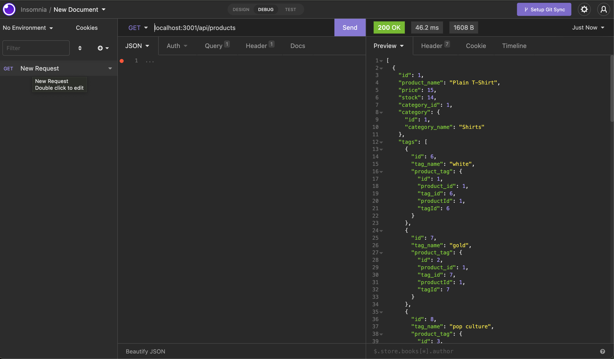

# Employee-Tracker

This Node application involves a fictional E-Commerce database, allowing users to perform CRUD operations on Products, Product Categories, and Product Tags.

## Screenshots

## Installation and Start Up

1. To install, `git clone` the repository and run `npm install` to install dependencies.

2. Create a .env file and structure it as described in .env.EXAMPLE, including your own MYSQL connection info.

3. You must have MYSQL installed on your computer to use this application. Open up a connection to MYSQL in the root directory and run `source db/schema.sql` to create the database.

4. Run `npm run seed` in the root directory to seed the data to the database.

5. `npm start` will open a database connection and start the server, which can then be accessed in Postman or Insomnia at the appropriate route.

## Technologies

This app uses Node.js, MYSQL, Sequelize, and Express.

## Video Walkthrough

[Link to video](https://drive.google.com/file/d/1WeBht3BpPkU8HJ289gOdG-08h-JRA_8H/view?usp=sharing)
